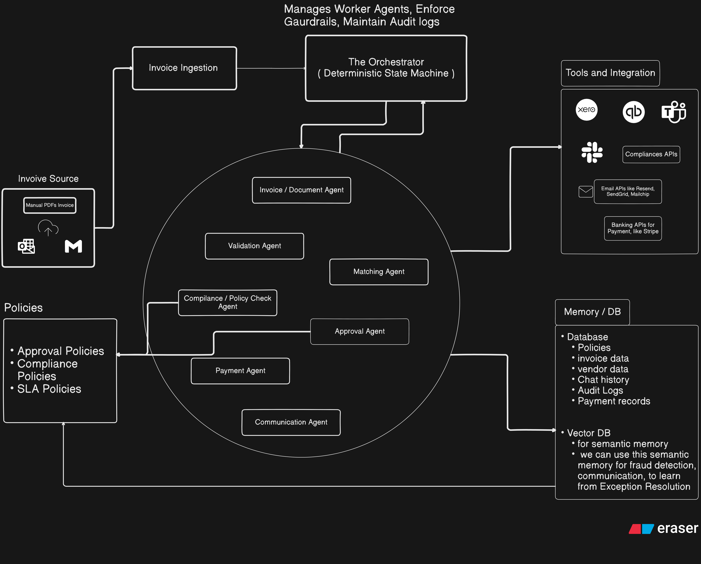
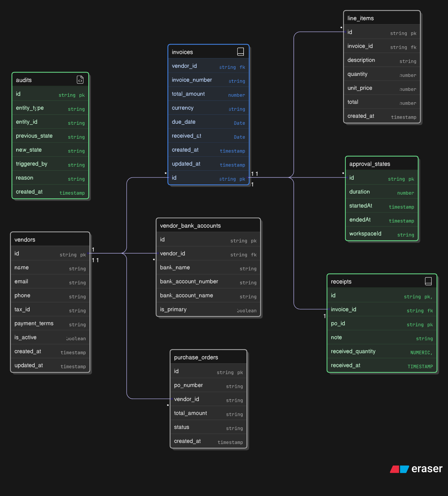

# Agentic AI AP Employee

An intelligent, AI-powered Accounts Payable (AP) automation system that leverages multiple specialized agents to streamline invoice processing, validation, matching, compliance checks, approvals, and payments.

## Overview

This system replaces manual AP workflows with an agentic AI architecture that autonomously handles the entire invoice-to-payment lifecycle while maintaining compliance, audit trails, and human oversight where needed.

## Architecture

### High-Level System Design




```
┌─────────────────────────────────────────────────────────────────────────────┐
│                              Invoice Sources                                │
│          (Manual PDF Upload | Gmail | Outlook)                              │
└─────────────────────────────────┬───────────────────────────────────────────┘
                                  │
                                  ▼
┌─────────────────────────────────────────────────────────────────────────────┐
│                           Invoice Ingestion                                 │
└─────────────────────────────────┬───────────────────────────────────────────┘
                                  │
                                  ▼
┌─────────────────────────────────────────────────────────────────────────────┐
│                    The Orchestrator (State Machine)                         │
│         Manages Worker Agents | Enforces Guardrails | Maintains Audit Logs  │
└─────────────────────────────────┬───────────────────────────────────────────┘
                                  │
        ┌─────────────────────────┼─────────────────────────┐
        ▼                         ▼                         ▼
┌───────────────┐    ┌────────────────────┐    ┌───────────────────┐
│   Policies    │    │   Worker Agents    │    │ Tools/Integration │
├───────────────┤    ├────────────────────┤    ├───────────────────┤
│ • Approval    │    │ • Document Agent   │    │ • Xero            │
│ • Compliance  │◄──►│ • Validation Agent │◄──►│ • QuickBooks      │
│ • SLA         │    │ • Matching Agent   │    │ • Slack           │
└───────────────┘    │ • Compliance Agent │    │ • Email APIs      │
                     │ • Approval Agent   │    │ • Banking APIs    │
                     │ • Payment Agent    │    └───────────────────┘
                     │ • Communication    │
                     └─────────┬──────────┘
                               │
                               ▼
                     ┌────────────────────┐
                     │    Memory / DB     │
                     ├────────────────────┤
                     │ • Relational DB    │
                     │ • Vector DB        │
                     └────────────────────┘
```


### Worker Agents

| Agent | Responsibility |
|-------|----------------|
| **Invoice/Document Agent** | Extracts and parses invoice data from various formats (PDF, images, emails) |
| **Validation Agent** | Validates invoice data, checks for duplicates, verifies vendor information |
| **Matching Agent** | Performs 2-way/3-way matching between invoices, POs, and receipts |
| **Compliance/Policy Agent** | Ensures invoices meet compliance requirements and internal policies |
| **Approval Agent** | Routes invoices through appropriate approval workflows based on rules |
| **Payment Agent** | Processes approved payments and updates payment records |
| **Communication Agent** | Handles notifications, reminders, and stakeholder communications |

## Database Schema


### Entity Descriptions

| Table | Purpose |
|-------|---------|
| `vendors` | Stores vendor/supplier information including contact details and payment terms |
| `invoices` | Core invoice data with amounts, dates, and vendor references |
| `line_items` | Individual line items within each invoice |
| `vendor_bank_accounts` | Bank account details for vendor payments |
| `purchase_orders` | Purchase orders for 3-way matching |
| `receipts` | Goods receipt records for matching verification |
| `approval_states` | Tracks approval workflow states and durations |
| `audits` | Complete audit trail of all state changes |

## Features

- **Multi-Source Invoice Ingestion**: Accept invoices via PDF upload, QR code scanning, or email integration (Gmail)
- **Intelligent Document Processing**: AI-powered extraction of invoice data from various formats
- **Automated Validation**: Duplicate detection, vendor verification, and data validation
- **Smart Matching**: 2-way and 3-way matching between invoices, POs, and receipts
- **Policy Enforcement**: Configurable approval policies, compliance rules, and SLA tracking
- **Approval Workflows**: Dynamic routing based on amount thresholds and business rules
- **Payment Processing**: Integration with banking APIs for automated payments
- **Communication Automation**: Automated notifications via email and Slack
- **Complete Audit Trail**: Full traceability of all actions and state changes
- **Semantic Memory**: Vector database for fraud detection and learning from exceptions


